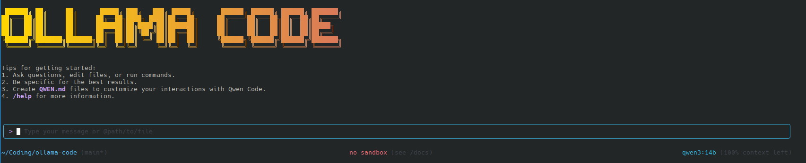

# Ollama Code



Ollama Code is a privacy-focused command-line AI workflow tool forked from [**Qwen Code**](https://github.com/QwenLM/qwen-code), designed to work with locally-hosted [Ollama](https://ollama.com) models for enhanced privacy and data sovereignty. This tool gives you the power of AI-assisted development while keeping your code and data completely under your control.

## 🔒 Privacy & Data Sovereignty First

**Your code never leaves your environment.** Unlike cloud-based AI tools, Ollama Code processes everything locally through your own Ollama server, ensuring:

- **Complete Privacy**: No data transmission to external services
- **Data Sovereignty**: Full control over your models and processing
- **Offline Capability**: Work without internet dependency once models are downloaded
- **Enterprise Ready**: Perfect for sensitive codebases and air-gapped environments

## ⚠️ Quality Considerations

**Important:** This tool uses local Ollama models which may have different capabilities compared to cloud-based models:

- **Smaller models** (7B-14B parameters) may provide less accurate results than larger cloud models
- **Response quality** varies significantly based on your chosen model and hardware
- **Complex reasoning tasks** may require larger models (70B+) for optimal results
- **Consider your use case**: Test with your specific workflows to ensure model suitability

## Key Features

- **Code Understanding & Editing** - Query and edit large codebases beyond traditional context window limits
- **Workflow Automation** - Automate operational tasks like handling pull requests and complex rebases
- **Local Model Support** - Works with any Ollama-compatible model (Qwen, Llama, CodeLlama, etc.)
- **Privacy-First Architecture** - All processing happens on your infrastructure

## Quick Start

### Prerequisites

1. **Node.js**: Ensure you have [Node.js version 20](https://nodejs.org/en/download) or higher installed
2. **Ollama Server**: Install and run [Ollama](https://ollama.com) with your preferred models

### Installation

```bash
npm install -g @tcsenpai/ollama-code
ollama-code --version
```

Then run from anywhere:

```bash
ollama-code
```

Or install from source:

```bash
git clone https://github.com/tcsenpai/ollama-code.git
cd ollama-code
npm install
npm install -g .
```

### Ollama Server Setup

1. **Install Ollama** (if not already installed):
   ```bash
   curl -fsSL https://ollama.com/install.sh | sh
   ```

2. **Download a coding model**:
   ```bash
   ollama pull qwen2.5-coder:14b  # Recommended for code tasks
   # or
   ollama pull codellama:13b      # Alternative coding model
   # or
   ollama pull llama3.1:8b        # Smaller, faster option
   ```

3. **Start Ollama server**:
   ```bash
   ollama serve
   ```

### Configuration

Configure your Ollama connection (the tool auto-detects local Ollama by default):

```bash
# Optional: Custom Ollama server
export OLLAMA_BASE_URL="http://localhost:11434/v1"
export OLLAMA_MODEL="qwen2.5-coder:14b"

# Or create ~/.config/ollama-code/config.json:
{
  "baseUrl": "http://localhost:11434/v1",
  "model": "qwen2.5-coder:14b"
}
```

## Usage Examples

### Explore Codebases

```sh
cd your-project/
ollama-code
> Describe the main pieces of this system's architecture
```

### Code Development

```sh
> Refactor this function to improve readability and performance
```

### Automate Workflows

```sh
> Analyze git commits from the last 7 days, grouped by feature and team member
```

```sh
> Convert all images in this directory to PNG format
```

## Popular Tasks

### Understand New Codebases

```text
> What are the core business logic components?
> What security mechanisms are in place?
> How does the data flow work?
```

### Code Refactoring & Optimization

```text
> What parts of this module can be optimized?
> Help me refactor this class to follow better design patterns
> Add proper error handling and logging
```

### Documentation & Testing

```text
> Generate comprehensive JSDoc comments for this function
> Write unit tests for this component
> Create API documentation
```

## Recommended Models

For optimal results with coding tasks:

| Model | Size | Best For | Quality | Speed |
|-------|------|----------|---------|-------|
| `qwen2.5-coder:14b` | 14B | Code generation, refactoring | ⭐⭐⭐⭐ | ⭐⭐⭐ |
| `codellama:13b` | 13B | Code completion, debugging | ⭐⭐⭐ | ⭐⭐⭐ |
| `llama3.1:8b` | 8B | General coding, faster responses | ⭐⭐ | ⭐⭐⭐⭐ |
| `qwen2.5-coder:32b` | 32B | Complex reasoning, best quality | ⭐⭐⭐⭐⭐ | ⭐⭐ |

## Project Structure

```
ollama-code/
├── packages/           # Core packages
├── docs/              # Documentation
├── examples/          # Example code
└── tests/            # Test files
```

## Development & Contributing

See [CONTRIBUTING.md](./CONTRIBUTING.md) to learn how to contribute to the project.

## Privacy & Security

- **Local Processing**: All AI computations happen on your Ollama server
- **No Telemetry**: No usage data is transmitted externally
- **Code Isolation**: Your source code never leaves your environment
- **Audit Trail**: Full visibility into all AI interactions

## Troubleshooting

If you encounter issues, check the [troubleshooting guide](docs/troubleshooting.md).

Common issues:
- **Connection refused**: Ensure Ollama is running (`ollama serve`)
- **Model not found**: Pull the model first (`ollama pull model-name`)
- **Slow responses**: Consider using smaller models or upgrading hardware

## Acknowledgments

This project is forked from [**Qwen Code**](https://github.com/QwenLM/qwen-code), which was originally based on [Google Gemini CLI](https://github.com/google-gemini/gemini-cli). We acknowledge and appreciate the excellent work of both teams. Our contribution focuses on privacy-first local model integration through Ollama.

## License

[LICENSE](./LICENSE)